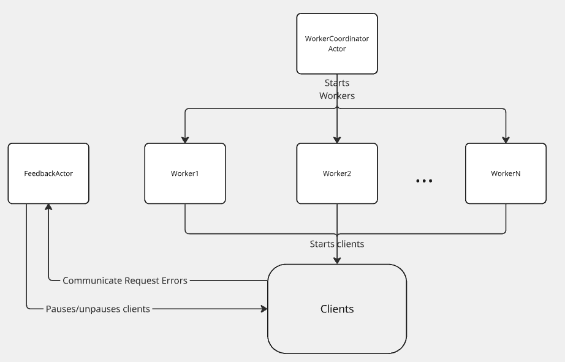

# Redline Testing
The `--redline-test` command enables OpenSearch Benchmark to automatically determine the maximum request throughput your OpenSearch cluster
can handle under increasing load. This dynamically adjusts the number of active clients based on real-time cluster performance, and can
assist with capacity planning or detecting performance regressions.

### Usage
To perform a redline test, use the `execute-test` command with the `--redline-test` flag, using a timed test procedure.

Example of a timed test procedure:
```json
{
  "name": "timed-mode-test-procedure",
  "schedule": [
    {
       "operation": "keyword-terms",
       "warmup-time-period": {{ warmup_time | default(300) | tojson }},
       "time-period": {{ time_period | default(900) | tojson }},
       "target-throughput": {{ target_throughput | default(20) | tojson }},
       "clients": {{ search_clients | default(20) }}
    }
  ]
}
```

which allows us to use:
```bash
opensearch-benchmark execute-test \
  --pipeline=benchmark-only \
  --target-hosts=<your-opensearch-cluster> \
  --workload=<workload> \
  --test-procedure=timed-mode-test-procedure \
  --redline-test
```

### How It Works

When the --redline-test flag is used:

1. Client Initialization: OSB spawns a large number of clients (default is 1000, configurable via `--redline-test=<int>`).

2. Feedback Mechanism: OSB will begin ramping up the number of active clients. A FeedbackActor monitors real-time request failures and adjusts the number of active clients accordingly.

3. Shared State Coordination: OSB uses Python's multiprocessing library to manage shared dictionaries and queues for inter-process communication:
    - Workers: Create and share client state maps with the WorkerCoordinatorActor.
    - WorkerCoordinatorActor: Aggregates and forwards client states to the FeedbackActor.
    - FeedbackActor: Scales up clients until request errors are detected, then pauses clients and enters a sleep period before resuming.



### Additional Notes
- The number of clients to scale up can be customized using `--redline-test=<int>`. For example, `--redline-test=1500` sets the maximum number of clients to 1500.

- Upon detecting a request error, the new `FeedbackActor` will pause clients and enter a 30 second sleep period before attempting to scale up again

- OSB provides detailed logs, like scaling decisions and request failures during a redline test

### Results
At the end of the test, OSB logs the maximum number of clients the cluster supported without errors.
```
[WARNING] Error rate is 15.0 for operation 'keyword-terms'. Please check the logs.
Redline test finished. Maximum stable client number reached: 410
```