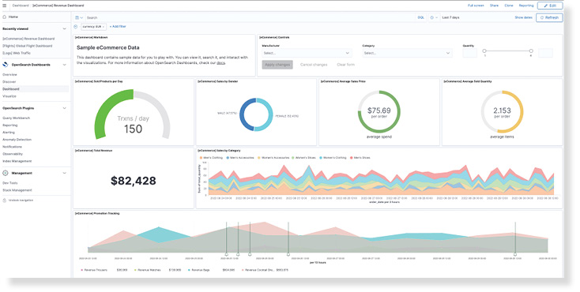

The `/docs/opensearch-dashboards/` redirect is specifically to support the UI links in OpenSearch Dashboards 1.0.0.

# What is OpenSearch Dashboards?

OpenSearch Dashboards is an open-source analytics and search application that gives you a view of information and data all in one view. OpenSearch Dashboards allows you to monitor events, make decisions, inform others, and see trends and displays multiple visualizations that work together on a single screen. These visuals give you a comprehensive view of your data and provide key insights for at-a-glance decision-making.

OpenSearch Dashboards allows you to create dashboards for many reasons, and many types of dashboards. OpenSearch Dashboards lets you to do the following:  

* See-all in one view-the data you need to make informed decisions.
* Search, explore, filter, aggregate, and visualize your data in near real time.
* Track and monitor the most important information about your day-to-day operations. 
* Schedule, export, and share reports from dashboards, saved searches, alerts, and visualizations. 

The type of dashboards you create depends on the  different teams and people within and outside your organization. OpenSearch Dashboards are created to be intuitive and easy to understand by users like business analysts, senior executives, engineering managers, and operations managers.  

# Starting work with OpenSearch Dashboards

To get started with OpenSearch Dashboards, you must first [install and configure the OpenSearch engine](../_opensearch/install/index.md).

To get started creating your own dashboard, see [Getting started with OpenSearch Dashboards](install/index.md).
