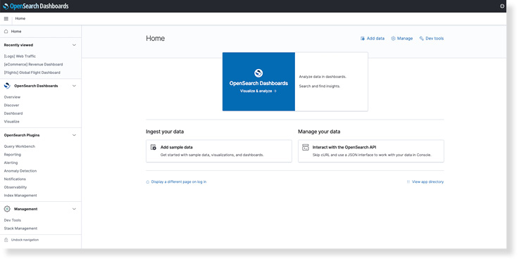

The `/docs/opensearch-dashboards/` redirect is specifically to support the UI links in OpenSearch Dashboards 1.0.0.

# What is OpenSearch Dashboards?

OpenSearch Dashboards is an open-source analytics and search application for the OpenSearch engine. With OpenSearch Dashboards, you can query, visualize, alert on, and understand your metrics no matter where they are stored. 

* **Report, analyze, and present your data in real time.** Automatically deploy a real-time dashboard that brings different data types together to display important metrics and insights in a way that’s understandable by everyone.
* **Track your data through dashboards.** Regularly or automatically update your dashboard to reflect the most current state of things.
* **Visualize your data for better understanding.** Chart, graph, and plot your data to understand what’s going on is to look for patterns, compare a variety of data simultaneously, and share your data with others.

# Starting work with OpenSearch Dashboards

To get started with OpenSearch Dashboards, you must have [installed and configured the OpenSearch engine](../_opensearch/install/index.md).

[Getting started with data analysis in OpenSearch Dashboards](install/index.md) gives you the information you need to complete important setup tasks and learn how to use a dashboard, create an analysis, and publish a dashboard.
