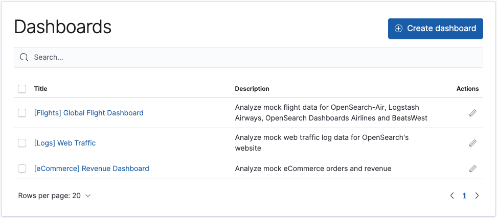

# OpenSearch Dashboards

OpenSearch Dashboards is the default visualization tool for data in OpenSearch. It also serves as a user interface for many of the OpenSearch plugins, including security, alerting, Index State Management, SQL, and more.

## Try OpenSearch Dashboards

You can try OpenSearch Dashboards' features in the [OpenSearch Dashboards Playground](https://playground.opensearch.org/app/home).

Choose **OpenSearch Dashboards > Dashboards > Create dashboard** and explore the sample Global Flight, Web Traffic, and Revenue dashboards.

## OpenSearch Dashboards for your use case

<table>
<thead>
</thead>
<tbody>
<tr>
<td>Analyze your log files</td>
<td>Deduce security vulnerabilities</td>
</tr>
<tr>
<td>See patterns in your data</td>
<td>Find the most popular products on your site</td>
</tr>
</tbody>
</table>

## Installing OpenSearch Dashboards

The basic installation of Dashboards includes the following features:

- [Discover](https://github.com/opensearch-project/documentation-website/issues/991): Lets you see the OpenSearch data.
- [Visualize](https://github.com/opensearch-project/documentation-website/issues/992): Lets you create visualizations for the data.
- [Dashboard](https://github.com/opensearch-project/documentation-website/issues/941): Displays multiple visualizations on a dashboard.

The default installation of Dashboards includes a full suite of [OpenSearch plugin]({{site.url}}{{site.baseurl}}/) features that lets you monitor events, identify trends, and automate recurring activities.

For more information, see [OpenSearch Installation Instructions]({{site.url}}{{site.baseurl}}/).

## Create a dashboard using sample data

Use the following steps to create a dashboard using sample data. Your dashboard may look different than the examples below.

1. Open OpenSearch Dashboards in the OpenSearch Dashboards Playground.
2. Select **Add sample data**, and select **Add data.**  
3. Choose **Discover** and search for a few flights.
4. Choose **Dashboard**, **[Flights] Global Flight Dashboard**.
5.  Click the **Save** icon next to the **Search** field to save the dashboard.
6.  Add a descriptive name, and then click **Save.**

You have created your dashboard, and it is displaying results.

## Compatibility with Elasticsearch

You can use OpenSearch Dashboards with an Elasticsearch backend 7.10 or lower. Elastic users may benefit from Dashboards' additional functionality provided by a growing ecosystem of OpenSearch plugins. For more information, see the [feature comparison of Opensearch Dashboards and Kibana]({{site.url}}{{site.baseurl}}).  See [Upgrade from Kibana OSS to OpenSearch Dashboards]({{site.url}}{{site.baseurl}}/upgrade-to/dashboards-upgrade-to) for instructions to switch to OpenSearch Dashboards.

