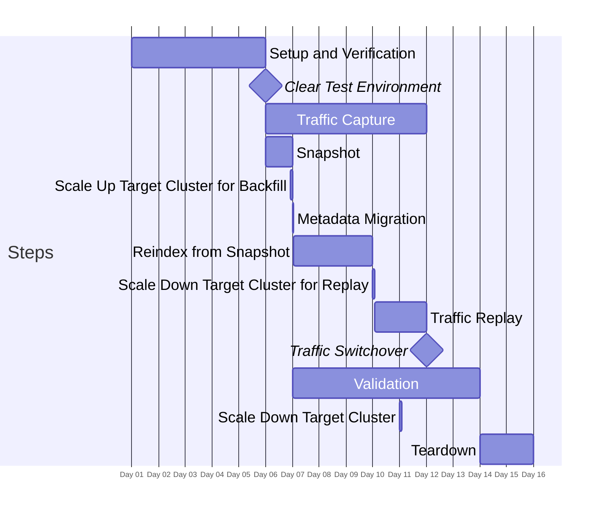
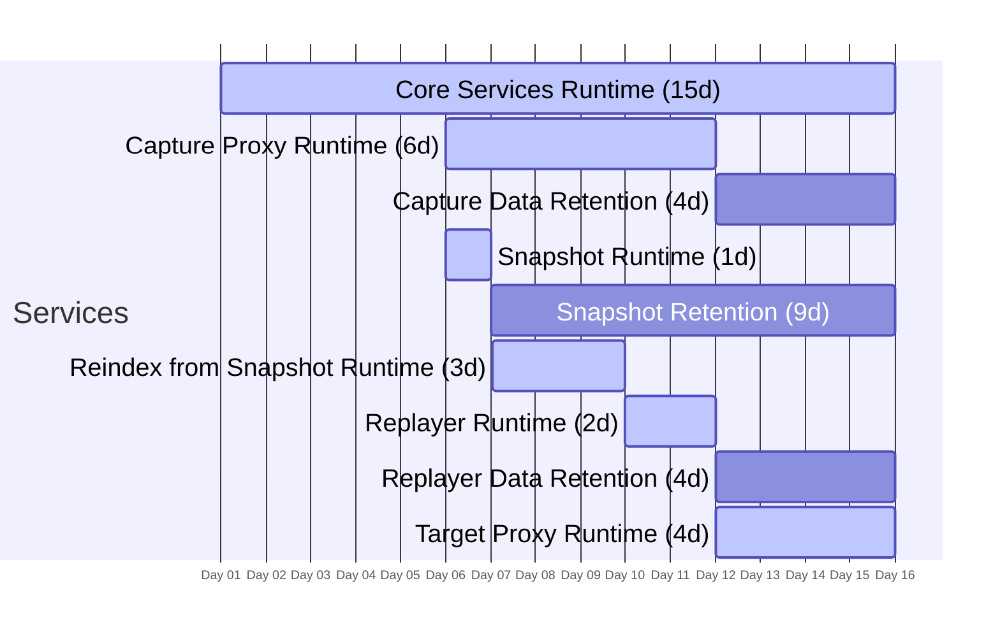

There is no *one-size-fits-most* migration strategy, this guide seeks to describe possible sample scenario(s) with the goal of helping customers plan their own migration strategy and estimate costs accordingly.

## 15 Day Historical and Live Migration

Key phases:

1. Setup, Planning, and Verification (Days 1-5)
1. Historical backfill, Catchup, and Validation (Days 6-10)
1. Final Validation, Traffic Switchover, and Teardown (Days 11-15)

### Timeline

#### Explanation of Scaling Operations

This section assumes a customer chooses to deliberatly scale their target cluster for backfill and/or replay to enable a faster and/or cheaper overall migration. In the absence of this, backfill and replay steps may take much longer (likely increasing overall cost).

This plan assumes we can replay 6 days of captured data in under 2 days in order for the source and target clusters to be in sync. Take an example of a source cluster operating at avg. 90% CPU utilization to handle reads/writes from application code, it's improbable that a target cluster with the same scale and configuration will be able to support a request throughput of at least 3x in order to catchup in the given time. The same holds for backfill for write-heavy clusters or clusters where data has accumulated for a long time period, to follow this plan, the target cluster should be scaled such that it can ingest/index all the source data in under 3 days.

1. **Scale Up Target Cluster for Backfill**: Occurs after metadata migration and before reindexing. The target cluster is scaled up to handle the resource-intensive reindexing process faster.

2. **Scale Down Target Cluster for Replay**: Once the reindexing is complete, the target cluster is scaled down to a more appropriate size for the traffic replay phase. While still provisioned higher than normal production workloads, given replayer has a >1 speedup factor.

3. **Scale Down Target Cluster**: After the validation phase, the target cluster is scaled down to its final operational size. This step ensures that the cluster is rightsized for normal production workloads, balancing performance needs with cost-efficiency.

### Component Durations

This component duration breakdown is useful for identifying the cost of resources deployed during the migration process. It provides a clear overview of how long each component is active or retained, which directly impacts resource utilization and associated costs.

Note: Duration excludes weekends. If actual timeline extends over weekends, duration (and potentially costs) will increase.

| Component                         | Duration |
|-----------------------------------|----------|
| Core Services Runtime             | 15d      |
| Capture Proxy Runtime             | 6d       |
| Capture Data Retention            | 4d       |
| Snapshot Runtime                  | 1d       |
| Snapshot Retention                | 9d       |
| Reindex from Snapshot Runtime     | 3d       |
| Replayer Runtime                  | 2d       |
| Replayer Data Retention           | 4d       |
| Target Proxy Runtime              | 4d       |
