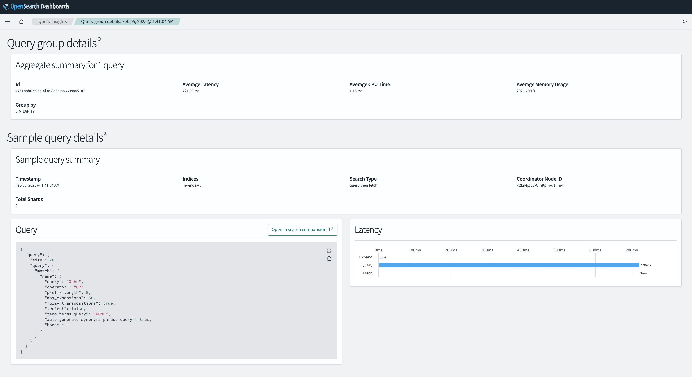
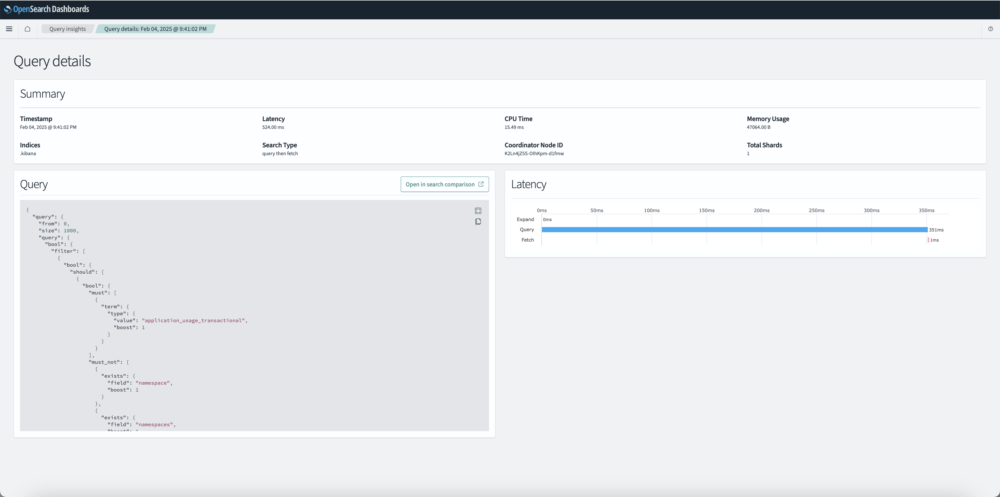

# Query Details

The **Query Details** page in OpenSearch Dashboards provides insights into query behavior, performance, and structure. This page can have two variations based on the context:

---

## 1. Query Group Details

This view provides insights into aggregated metrics for a group of similar queries. To navigate to this page, go to the **Query Insights** section and click on a **Query ID** marked as a "group" in the list (e.g., `4751b8b6-99eb-4f38-8a5a-aa6698a451a7`).

### **Aggregate Summary for Queries**
- Displays metrics such as:
   - **Average Latency**: Average time taken by the grouped queries.
   - **Average CPU Time**: Average CPU resources consumed by the grouped queries.
   - **Average Memory Usage**: Average memory used during execution of the grouped queries.

### **Group By**
- Indicates the criterion used to group the queries (e.g., similarity, search type).

### **Sample Query Details**
- Provides details about a single representative query within the group, including:
   - **Timestamp**: Time when the representative query was executed.
   - **Indices**: The targeted index or indices.
   - **Search Type**: Type of search execution (e.g., `query then fetch`).
   - **Coordinator Node ID**: Node that coordinated the execution.
   - **Total Shards**: Number of shards involved in execution.

### **Common Sections**

#### **Query Section**
- Displays the JSON structure of the query.
- Includes options to:
   - Copy the query JSON to the clipboard.
   - Open the query in Search Comparison.

#### **Latency Breakdown**
- A graphical representation of execution phases for the query:
   - **Expand**: Time spent expanding the query structure.
   - **Query**: Time spent executing the query logic.
   - **Fetch**: Time spent fetching query results.

---

## 2. Individual Query Details

This view focuses on a single query and provides detailed execution metrics and insights. To navigate to this page, go to the **Query Insights** section and click on a **Query ID** marked as "query" in the list (e.g., `51c68a1a-7507-4b3e-aea1-32ddd74dbac4`).

### **Summary Section**
- Displays high-level metrics for the query:
   - **Timestamp**: Time when the query was executed.
   - **Latency**: Total time taken to execute the query.
   - **CPU Time**: CPU resources consumed by the query.
   - **Memory Usage**: Memory used during execution.
   - **Indices**: Targeted index or indices.
   - **Search Type**: Type of search execution (e.g., `query then fetch`).
   - **Coordinator Node ID**: Node that coordinated the query execution.
   - **Total Shards**: Number of shards involved in execution.

### **Common Sections**
- The **Query Section** and **Latency Breakdown** are the same as described in the **Query Group Details** section above.

---

## Differentiating Factors

### **Scope**
- **Query Group Details**: Aggregates metrics for a set of similar queries.
- **Individual Query Details**: Focuses on metrics and insights for a single query.

### **Focus**
- **Query Group Details**: Highlights trends and averages across a group of queries.
- **Individual Query Details**: Enables pinpointing of optimization areas for a specific query.

---

## Best Practices

1. **Analyze Query Metrics**:
   - Use the **Summary Section** to identify potential bottlenecks (e.g., high latency or memory usage).

2. **Inspect Query JSON**:
   - Review the query DSL in the **Query Section** for correctness or optimization opportunities.
   - Use the **Copy Option** to export the query for further analysis.

3. **Investigate Latency**:
   - Analyze the **Latency Breakdown** graph to identify execution stages that require optimization.

4. **Compare Queries**:
   - Use the **Open in Search Comparison** option to compare this query with others for deeper insights.

---

