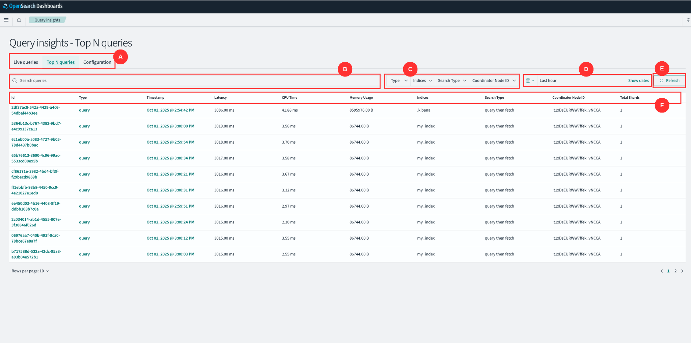
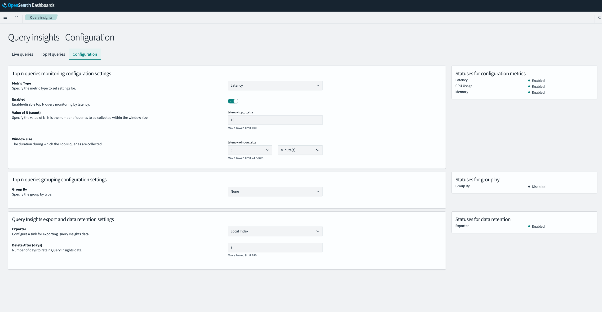

# Query Insights dashboards and visualizations

The **Query Insights Plugin** for OpenSearch Dashboards empowers users with real-time visibility into query performance. This plugin provides tools to analyze query execution, identify performance bottlenecks, and optimize system behavior. Whether you're monitoring latency, CPU usage, or memory utilization, Query Insights helps you maintain high performance and system reliability.

---

## Getting Started

Before you begin, ensure you have:

- Installed OpenSearch and OpenSearch Dashboards version 2.19 or later. See [Installing OpenSearch](#).
- Installed the Query Insights Dashboards plugin. See [Managing OpenSearch Dashboards Plugins](#).

Once the prerequisites are met, follow these steps:

1. **Verify Plugin Installation**:
    - Open OpenSearch Dashboards in your browser.
    - From the left navigation pane, locate the **OpenSearch Plugins** section.
    - Click on **Query Insights** to ensure the plugin is available and installed correctly.

2**Start Using the Plugin**:
    - Once installed and verified, you can begin:
        - Monitoring query performance and metrics using the **Query Insights** dashboard.
        - Grouping and analyzing query data based on various attributes.
        - Configuring export options and retention settings to suit your needs.
    - Once installed and verified, you can begin monitoring query performance, grouping data, and configuring export options.

# Query Insights - Top N Queries

The **Top N Queries** page provides a detailed overview of the queries that have the highest impact on system resources or performance. It allows users to analyze query execution metrics such as latency, CPU time, memory usage, and more. This page is essential for identifying and addressing performance bottlenecks in your OpenSearch cluster.

## Getting Familiar with the UI

Before getting started, let’s get familiar with the Dashboard UI. The UI comprises the following main components:

### A. Navigation Tabs
- **Top N Queries**: Displays the query metrics and details for the top queries.
- **Configuration**: Allows users to customize the monitoring and data retention settings (covered in the [Configuration](#) section).

### B. Search Queries Bar
A search input bar to filter queries based on specific attributes such as query type, indices, or other criteria.

### C. Filters
Provides dropdown filters for narrowing down the query data:

| Filter                  | Description                                                         | Example                 |
|--------------------------|---------------------------------------------------------------------|-------------------------|
| **Type**               | Filter by query type                                               | `query`, `aggregation` |
| **Indices**            | Filter queries based on specific OpenSearch indices                | `index1`, `index2`     |
| **Search Type**        | Filter by search execution method                                  | `query then fetch`     |
| **Coordinator Node ID** | Focus on queries executed by a specific coordinator node           | `node-1`, `node-2`     |
| **Time Range**          | Adjust the time range for the queries displayed                    | `last 1 day`           |

### D. Date Range Selector
- **Show Dates**: Provides detailed timestamps for the queries.
- Use the date range selector to analyze queries within a specific time frame (e.g., last 1 day).

### E. Refresh Button
- **Refresh**: Reloads the query data based on the selected filters and time range.

### F. Metrics Table
The table displays the following metrics for each query:

| Metric               | Description                                                                 |
|-----------------------|-----------------------------------------------------------------------------|
| **ID**               | Unique identifier for the query                                            |
| **Type**             | The type of query (e.g., `query`, `group`)                                 |
| **Query Count**      | The number of times the query has been executed                            |
| **Timestamp**        | When the query was executed                                                |
| **Latency**          | The time taken for the query to execute                                    |
| **CPU Time**         | The CPU resources consumed by the query                                    |
| **Memory Usage**     | The memory usage of the query                                              |
| **Indices**          | The index or indices on which the query was executed                      |
| **Search Type**      | The type of search execution (e.g., `query then fetch`)                   |
| **Coordinator Node ID** | The node that coordinated the query execution                              |
| **Total Shards**     | The total number of shards involved in executing the query                 |

# Query Details

The **Query Details** page in OpenSearch Dashboards provides insights into query behavior, performance, and structure. This page can have two variations based on the context:

---

## 1. Query Group Details

This view provides insights into aggregated metrics for a group of similar queries. To navigate to this page, go to the **Query Insights** section and click on a **Query ID** marked as a "group" in the list (e.g., `4751b8b6-99eb-4f38-8a5a-aa6698a451a7`).

### **Aggregate Summary for Queries**
- Displays metrics such as:
   - **Average Latency**: Average time taken by the grouped queries.
   - **Average CPU Time**: Average CPU resources consumed by the grouped queries.
   - **Average Memory Usage**: Average memory used during execution of the grouped queries.

### **Group By**
- Indicates the criterion used to group the queries (e.g., similarity, search type).

### **Sample Query Details**
- Provides details about a single representative query within the group, including:
   - **Timestamp**: Time when the representative query was executed.
   - **Indices**: The targeted index or indices.
   - **Search Type**: Type of search execution (e.g., `query then fetch`).
   - **Coordinator Node ID**: Node that coordinated the execution.
   - **Total Shards**: Number of shards involved in execution.

### **Common Sections**

#### **Query Section**
- Displays the JSON structure of the query.
- Includes options to:
   - Copy the query JSON to the clipboard.
   - Open the query in Search Comparison.

#### **Latency Breakdown**
- A graphical representation of execution phases for the query:
   - **Expand**: Time spent expanding the query structure.
   - **Query**: Time spent executing the query logic.
   - **Fetch**: Time spent fetching query results.

---

## 2. Individual Query Details

This view focuses on a single query and provides detailed execution metrics and insights. To navigate to this page, go to the **Query Insights** section and click on a **Query ID** marked as "query" in the list (e.g., `51c68a1a-7507-4b3e-aea1-32ddd74dbac4`).

### **Summary Section**
- Displays high-level metrics for the query:
   - **Timestamp**: Time when the query was executed.
   - **Latency**: Total time taken to execute the query.
   - **CPU Time**: CPU resources consumed by the query.
   - **Memory Usage**: Memory used during execution.
   - **Indices**: Targeted index or indices.
   - **Search Type**: Type of search execution (e.g., `query then fetch`).
   - **Coordinator Node ID**: Node that coordinated the query execution.
   - **Total Shards**: Number of shards involved in execution.

### **Common Sections**
- The **Query Section** and **Latency Breakdown** are the same as described in the **Query Group Details** section above.

---

## Differentiating Factors

### **Scope**
- **Query Group Details**: Aggregates metrics for a set of similar queries.
- **Individual Query Details**: Focuses on metrics and insights for a single query.

### **Focus**
- **Query Group Details**: Highlights trends and averages across a group of queries.
- **Individual Query Details**: Enables pinpointing of optimization areas for a specific query.

---

## Best Practices

1. **Analyze Query Metrics**:
   - Use the **Summary Section** to identify potential bottlenecks (e.g., high latency or memory usage).

2. **Inspect Query JSON**:
   - Review the query DSL in the **Query Section** for correctness or optimization opportunities.
   - Use the **Copy Option** to export the query for further analysis.

3. **Investigate Latency**:
   - Analyze the **Latency Breakdown** graph to identify execution stages that require optimization.

4. **Compare Queries**:
   - Use the **Open in Search Comparison** option to compare this query with others for deeper insights.

---

# Query Insights - Configuration

The **Configuration** page is designed to give users control over how Query Insights collects, monitors, groups, and retains data. Each section of this page is outlined in detail below.

---

## 1. Top N Queries Monitoring Configuration Settings
This section configures the monitoring of the top N queries based on specific metrics (e.g., Latency, CPU Usage, Memory).

### Fields
1. **Metric Type**:
   - Allows users to select the performance metric to monitor.
   - Options include:
      - **Latency**: Monitor the time taken by queries to execute.
      - **CPU Usage**: Monitor the CPU resources consumed by queries.
      - **Memory**: Monitor memory utilization for queries.

2. **Enabled**:
   - A toggle to enable or disable monitoring for the selected metric.
   - When **enabled**, the system will track and record the top N queries for the specified metric.

3. **Value of N (count)**:
   - Defines the number of top queries to monitor during each time window.
   - Example:
      - If set to `10`, the system will collect metrics for the top 10 queries.
   - **Limits**:
      - Minimum: 1
      - Maximum: 100

4. **Window Size**:
   - Specifies the duration during which Top N queries are collected.
   - Example:
      - If set to `5 minutes`, the plugin will calculate the top N queries every 5 minutes.
   - **Limits**:
      - Minimum: 1 minute
      - Maximum: 24 hours

---

## 2. Top N Queries Grouping Configuration Settings
This section enables grouping of the monitored queries by specific attributes, allowing users to analyze query performance patterns.

### Fields
1. **Group By**:
   - Defines the criteria for grouping queries.
   - Example grouping options (based on configuration):
      - **None**: No grouping is applied.
      - **Similarity**: Group queries based on types like search, index, or delete.
   - **Disabled State**:
      - If "Group By" is not configured, it will remain disabled.

---

## 3. Query Insights Export and Data Retention Settings
This section configures how query data is exported and how long it is retained in the system.

### Fields
1. **Exporter**:
   - Specifies the destination (sink) for exporting query insights data.
   - Options include:
      - **Local Index**: Stores data locally within OpenSearch.

2. **Delete After (days)**:
   - Determines how long the query insights data is retained before deletion.
---

## 4. Status Panels
These panels provide a real-time overview of the current configuration status for different components.

### Panels
1. **Statuses for Configuration Metrics**:
   - Shows the status of each metric being monitored (e.g., Latency, CPU Usage, Memory).
   - Example:
      - **Enabled**: Indicates the metric is actively monitored.
      - **Disabled**: Indicates the metric is not monitored.

2. **Statuses for Group By**:
   - Displays the status of the "Group By" configuration:
      - **Enabled**: Grouping is active.
      - **Disabled**: Grouping is not applied.

3. **Statuses for Data Retention**:
   - Indicates the status of data export and retention:
      - **Enabled**: Exporting and retention policies are active.
      - **Disabled**: Exporting is not configured.

---

## Best Practices
1. **Start Small**:
   - Begin with a smaller value for **N (count)** and adjust based on your system's load and query volume.
2. **Set Appropriate Retention Periods**:
   - Shorter retention periods help save storage but may limit long-term insights.
3. **Enable Metrics Based on Need**:
   - Focus on one or two critical metrics (e.g., Latency or CPU Usage) to avoid overwhelming the system.

---

