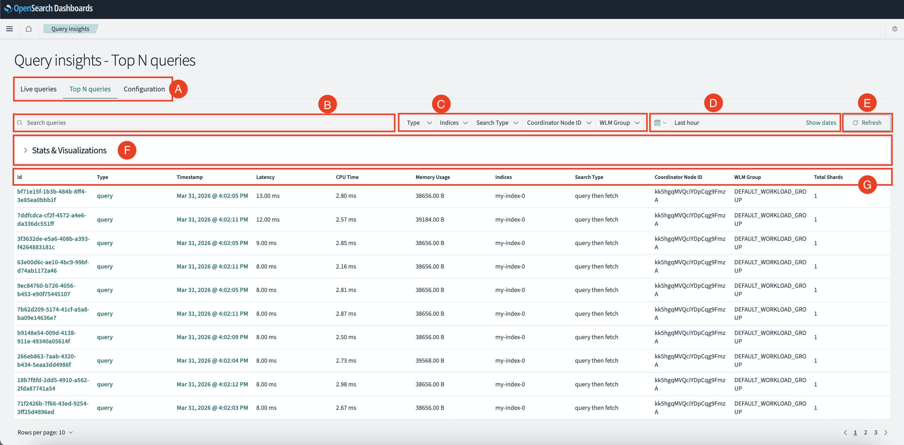
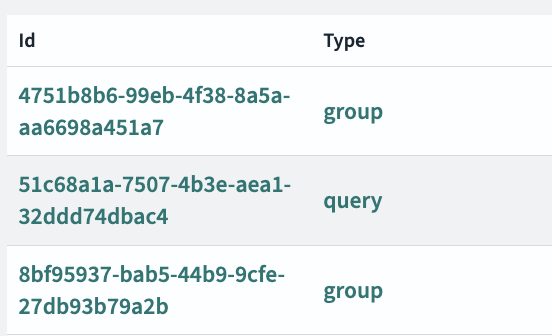
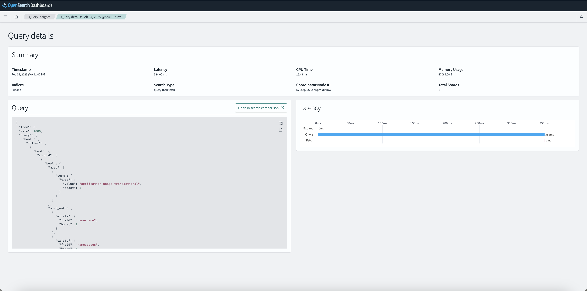
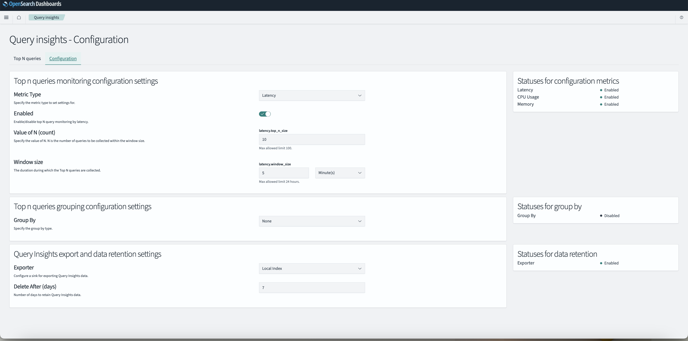

# Query insights dashboards

You can interact with the query insights feature using the Query Insights Dashboards plugin. This plugin gives you real-time insights into query performance, providing analytics, and monitoring to improve how queries are run in your cluster.

## Prerequisites

The Query Insights Dashboards plugin requires [OpenSearch 2.19 or later]({{site.url}}{{site.baseurl}}/install-and-configure/). 

## Installing the plugin

To install the `query-insights-dashboards` plugin, see [Managing OpenSearch Dashboards plugins]({{site.url}}{{site.baseurl}}/install-and-configure/install-dashboards/plugins/).

## Navigation

After logging in to OpenSearch Dashboards, you can find the Query Insights page by navigating to **OpenSearch Plugins** > **Query Insights**. 

If you have [multiple data sources]({{site.url}}{{site.baseurl}}/dashboards/management/multi-data-sources/) enabled, the Query insights page can be found by navigating to **Data administration** > **Performance** > **Query insights**.
{: .note}

The **Query insights** dashboard contains the following pages:

- [Top N queries](#top-n-queries): Displays the query metrics and details for the top queries.
- [Query details](#query-details): Displays details for individual queries and query groups.
- [Configuration](#configuration): Customizes all monitoring and data retention settings for the query insights feature.

## Top N queries

The **Top N queries** page provides a detailed overview of the queries that have the highest impact on system resources or performance. There, you can analyze query metrics such as **latency**, **CPU time**, and **memory usage**.

The following image of the **Top N Queries** page contains letter labels for each component:

Each label corresponds with the following components:

- [A. Navigation tabs](#a-navigation-tabs)
- [B. Search queries bar](#b-search-queries-bar)
- [C. Filters](#c-filters)
- [D. Date range selector](#d-date-range-selector)
- [E. Refresh button](#e-refresh-button)
- [F. Metrics table](#f-metrics-table)

### A. Navigation tabs

The navigation tabs allow you to switch between the Configuration and Top N Queries pages.

### B. Search queries bar

The search queries bar filters queries based on specific attributes such as **query type** or **indexes**. You can use additional filters as shown in the [filters](#c-filters) section.

### C. Filters

The filters dropdown menus allow you to select the following query filters.

| Filter                  | Description                                                         | Example            |
|-------------------------|---------------------------------------------------------------------|--------------------|
| **Type**                | Filter by query type.                                               | `query`, `group`   |
| **Indexes**             | Filter queries based on specific OpenSearch indices.                | `index1`, `index2` |
| **Search Type**         | Filter by search execution method.                                  | `query then fetch` |
| **Coordinator Node ID** | Focus on queries executed by a specific coordinator node.           | `node-1`, `node-2` |
| **Time Range**          | Adjust the time range for the queries displayed.                    | `last 1 day`       |

### D. Date range selector

The **data range selector** analyze queries in a set time frame. You can also select **show dates** to provide detailed time stamps for each query.

- **Show Dates**: Provides detailed timestamps for the queries.
- Use the date range selector to analyze queries within a specific time frame (e.g., last 1 day).

### E. Refresh button

The **Refresh** option reloads the query data based on the selected filters and time range.

### F. Metrics table

The table displays the following metrics for each query:

| Metric                  | Description                                                                 |
|-------------------------|-----------------------------------------------------------------------------|
| **ID**                  | The unique identifier for the query                                         |
| **Type**                | The type of query, such as `query`or `group`.                               |
| **Query Count**         | The number of times the query has been executed.                            |
| **Timestamp**           | When the query was ran.                                                     |
| **Latency**             | The time taken for the query to execute.                                    |
| **CPU Time**            | The CPU resources consumed by the query.                                    |
| **Memory Usage**        | The memory usage of the query.                                              |
| **Indexes**             | The index or indexes on which the query was executed.                       |
| **Search Type**         | The type of search used, for example, `query then fetch`.                   |
| **Coordinator Node ID** | The node that coordinated the query.                                        |
| **Total Shards**        | The total number of shards involved in running the query.                    |

## Query details

The **Query Details** page in OpenSearch Dashboards provides insights into query behavior, performance, and structure. This page can have two variations based on the context:

### Viewing individual query details

You can access detailed information about a single query by select the Query ID, such as `51c68a1a-7507-4b3e-aea1-32ddd74dbac4`. The query details page will appear, as shown in the following image:

In the query details view, you can view the following information such as **Timestamp**, **CPU Time**, **Memory Usage**, **indexes**, **Search Type**, **Coordinator Node ID**, and **Total Shards**.

### Viewing query group details

This query group details view provides insights into aggregated metrics for a group of similar queries.

To view query group details, select a Query ID marked as a "group" in the **Top N queries** list. In the query group details view, you can view the following information:

- The **Aggregate Summary for Queries** section, gives a view of key query metrics for the entire group, including **average latency**, **average CPU time**, **average memory usage**, and, **Group by** criteria.
- The **Sample query details** section provides information about a single representative query including its **timestamp**, **indexes**, **Search Type**, **Coordinator Node ID**, and the **Total Shards**.
- The **Query** section displays the JSON structure of the query. 
- The **Latency Breakdown** section presents a graphical representation of the run phases for the query.

## Configuration

The **Query insights - Configuration** page is designed to gives you control over how query insights collects, monitors, groups, and retains data. The following image shows the configuration page:

On the page, you can configure the following settings.

### Top N queries monitoring

The **Top n queries monitoring configuration settings** allows you to track query performance metrics, such as **Latency, CPU Usage, and Memory**, to analyze and optimize query performance. The configuration interface provides a structured, menu-driven setup where you can define the specific metrics to monitor, set thresholds for analysis, and customize monitoring durations.

To configuring the Top N Queries settings:

1. From the **Query insights** page, Navigate to the **Configuration** tab from the **Query insights** page.
2. In the **Dashboards** window, select **Create**, then choose **Dashboard**.
3. Select the metric type from **Latency, CPU Usage, or Memory**.
4. Toggle the **Enabled** setting to turn monitoring on or off for the selected metric.
5. Enter the value of **N**, which defines the number of top queries to track.
6. Specify the monitoring **Window size**, determining the time duration for the query analysis.
7. Select **Save**.
8. Check the **Statuses for configuration metrics** panel to see the enabled metrics.

### Top N queries grouping 

The **Top n queries group configuration settings** sets the grouping settings for queries.

You can set the following specific grouping attributes using these steps.

1. Select a grouping option under **Group By**, such as **Similarity**.
2. Select **Save**.
3. Check the **Statues for group by** panel to see if **Group by** criteria is enabled.

### Data export and retention

To configuring data export and retention, use the **Query insights export and data retention settings** panel. There, you can set the following settings:

1. Under **Exporter**, choose a destination where to export the insight data, such as **Local index**.
2. Set the **Delete After (days)** field with a data retention period.
3. Select **Save**.
4. In the **Statuses for data retention** panel, make sure that the **Exporter** setting is enabled.

### Configuration best practices

When configuring the query insights feature, remember the following best practices:

- Begin with a smaller value for N (count) and increase it based on your system's load.
- When setting the retention periods for insight data, consider a shorter retention period that saves storage but reduces long-term insights.
- Enable metrics based on your monitoring needs. Monitoring fewer metrics prevents system overload.

