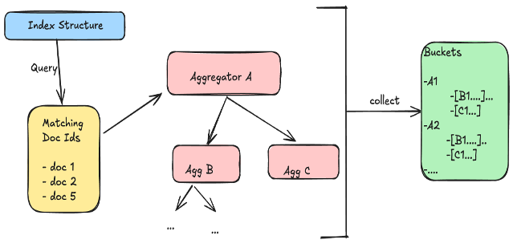

OpenSearch is widely used for data analytics, especially when working with time-series data. A core feature of time-series analysis is the date histogram aggregation, which groups documents by date or timestamp into defined intervals like months, weeks, or days. This grouping is crucial for visualizing trends and patterns, such as viewing the hourly number of HTTP requests to a website.

However, as data volume grows, the computation required for these aggregations can slow down analysis and dashboard responsiveness. Traditionally, aggregations iterated over every relevant document to place it into the correct time bucket, a method that becomes inefficient at scale.

About a year ago, we embarked on an ambitious journey to improve date histogram aggregation performance in OpenSearch. What started as incremental optimizations led to dramatic improvements - in some cases up to 100x faster query responses. This post shares our story of achieved those remarkable results and evolution of those optimization.

## Understanding the Aggregation Types

Before diving into optimizations, let's quickly cover the fundamentals. OpenSearch supports three main types of aggregations:
1. **Metric Aggregations**: Used for computing statistics like min, max, sum, or average
2. **Bucket Aggregations**: Groups documents together (by date, terms, or ranges)
3. **Pipeline Aggregations**: Combines multiple aggregations, using output from one as input to another
As part of this blog, we will mainly focus on Date Histogram aggregations which is subtype of Bucket Aggregations

## Why optimize Date Histograms: Use cases and benefits

While performance optimizations are quite valuable in general, even more so for Date histograms which is widely used across various use cases. For example:

- Analyzing web traffic patterns
- Monitoring application metrics and logs
- Visualizing sales trends
- Tracking IoT sensor data

Optimizing date histogram performance offers the following benefits:

- **Faster analysis**: Reduced dashboard load times for time-series visualizations.
- **Improved scalability**: Efficient handling of large data volumes without sacrificing performance.

## How numeric data is stored in OpenSearch

To address these inefficiency challenges, OpenSearch introduced optimizations that use the underlying index structure of date fields to significantly accelerate aggregation performance. To understand the optimizations better, let's review how OpenSearch stores numeric data like timestamps (using Lucene). Numeric data is stored in two main structures:

1. **Document values (doc values)**: A columnar structure optimized for operations like sorting and aggregations. The traditional aggregation algorithm iterates over these values.
2. **Index tree (BKD tree)**: A specialized index structure (a one-dimensional BKD tree for date fields) designed for fast range filtering. An index tree consists of inner nodes and leaf nodes. Values are stored only in leaf nodes, while inner nodes store the bounding ranges of their children. This structure allows efficient traversal in a sorted order to find documents within specific ranges.

## How Aggregation works in OpenSearch

{:class="img-centered" width="650px"}

By default, OpenSearch processes aggregations by first evaluating each query condition on every shard using Lucene, which builds iterators that identify matching document IDs. These iterators are then combined (e.g., using logical AND) to find documents that satisfy all query filters. The resulting set of matching document IDs is streamed to the aggregation framework, where each document flows through one or more aggregators. These aggregators use Lucene’s doc values (explained above) to efficiently retrieve the field values needed for computation (e.g., for calculating averages or counts). This streaming model is hierarchical—documents pass through a pipeline of aggregators, allowing them to be grouped into top-level and nested buckets simultaneously. For example, a document can first be bucketed by month, then further aggregated by HTTP status code within that month. This design enables OpenSearch to process complex, multi-level aggregations efficiently in a single pass over the matching documents.

## Understanding the setup

We primarily used the nyc_taxis workload of opensearch-benchmark-workloads for understanding the bottlenecks during the execution of date histogram aggregations and  measuring the performance benefits using the optimizations. The query chosen was range query over dropoff time for an year with monthly date histogram aggregation:

```json
{
  "size": 0,
  "query": {
    "range": {
      "dropoff_datetime": {
        "gte": "2015-01-01 00:00:00",
        "lt": "2016-01-01 00:00:00"
      }
    }
  },
  "aggs": {
    "dropoffs_over_time": {
      "date_histogram": {
        "field": "dropoff_datetime",
        "calendar_interval": "month"
      }
    }
  }
}
```
While the number of nodes does not matter, we worked with single node cluster containing all the data of nyc_taxis dataset across 1 shard without any replicas. 

## Performance Bottlenecks

When we began analyzing performance, we started single date histogram aggregation query execution in loop and collected flame graphs during the execution [9310](https://github.com/opensearch-project/OpenSearch/issues/9310). The flame graph primarily indicated towards two key limitations:
1. **Data Volume Dependency**: Query latency was directly proportional to data volume. For example, a one-month aggregation taking 1 second would take 12 seconds for a year's worth of data.
2. **Bucket Count Impact**: Large numbers of buckets (like in minute-level aggregations) led to hash collision issues, further degrading performance.

## Optimization Journey

The following sections outline how the optimization evolved over time, starting with initial enhancements in OpenSearch 2.12 and culminating in broader support in OpenSearch 3.0.

### Initial Attempts
While based on our understanding of aggregation execution flow, the bottlenecks made lot of sense, but we were still surprised and curious. After all, we are just counting number of documents each month over a year and taking 7-8 seconds to return 12 count values seemed far too long!! So, we made some naive optimization attempts like:

#### Data Partitioning

Our first attempt involved splitting the 12 month query into concurrent 6 month operations, since the response from 2 operations can easily be merged together. While this reduced query time from 8 to 4 seconds [9310#issuecomment-1682647724](https://github.com/opensearch-project/OpenSearch/issues/9310#issuecomment-1682647724), the community feedback was this being zero-sum game - we weren't really reducing CPU cycles, just running them in parallel. With concurrent segment search feature, already providing these benefits, there was not much to be gained from this.


#### Data Slicing

We then tried a different approach - data slicing. Instead of getting the count using aggregation query, we rewrote into normal range query with track all documents to get the documents for single month. This reduced query time dramatically, to about 150 ms for 1 month [9310#issuecomment-1682627380](https://github.com/opensearch-project/OpenSearch/issues/9310#issuecomment-1682627380). Hence, even if we were to do individual operation for each month, the overall query time comes down from 8 seconds to around 2 seconds for whole year without increasing the concurrency and overall cpu cycles.

```json
{
  "size": 0,
  "track_total_hits": "true",
  "query": {
    "range": {
      "dropoff_datetime": {
        "gte": "2015-01-01 00:00:00",
        "lt": "2015-02-01 00:00:00"
      }
    }
  }
}
```

A major breakthrough came after we spent sometime to understand the execution of this query and why it is much faster than the aggregation query over same time range!!

### Phase 1: Filter Rewrite

Based on our understanding of range query execution, we came up with Filter Rewrite approach. It preemptively created a series of range filters, one for each bucket, in the requested date histogram. For example, the monthly aggregation over year can be rewritten as below:

```json
{
  "size": 0,
  "aggs": {
    "dropoffs_over_time ": {
      "filters": {
        "1420070400000": {
          "range": {
            "dropoff_datetime": {
              "gte": "2015-01-01 00:00:00",
              "lt": "2015-02-01 00:00:00"
            }
          }
        },
        "1422748800000": {
          "range": {
            "dropoff_datetime": {
              "gte": "2015-02-01 00:00:00",
              "lt": "2015-03-01 00:00:00"
            }
          }
        },
        "1425168000000": {
          "range": {
            "dropoff_datetime": {
              "gte": "2015-03-01 00:00:00",
              "lt": "2015-04-01 00:00:00"
            }
          }
        },
        ...
      }
    }
  }
}
```

This date histogram aggregation query generates filter corresponding to each bucket and leverages Lucene’s Points Index, which uses BKD trees, to significantly optimize the aggregation. This tree-based structure organizes data into nodes representing value ranges with associated document counts, enabling efficient traversal. By skipping irrelevant subtrees and leveraging early termination, the system reduces unnecessary disk reads and avoids visiting individual documents. which are executed in similar manner as range query using the index tree to determine counts for each bucket faster than document value iteration. Similar approach was also applied to the auto date histogram, composite aggregation on date histogram source, and, later on, numeric range aggregation with consecutive ranges (TODO: Why do we need consecutive ranges??).


The following diagrams illustrate how documents are counted per histogram bucket using the index tree. To efficiently count documents matching a range (e.g., 351 to 771), the traversal begins at the root, checking whether the target range intersects with the node’s range. If it does, the algorithm recursively explores the left and right subtrees. An important optimization is skipping entire subtrees: if a node’s range falls completely outside the query range (e.g., 1–200), it is ignored. Conversely, if a node’s range is fully contained within the query range (e.g., 401–600), the algorithm can return the document count from that node directly without traversing its children. This allows the engine to avoid visiting all leaf nodes, focusing only on nodes with partial overlaps. As a result, the operation becomes significantly faster—reducing complexity from linear (O(N)) to logarithmic (O(log N)) in many cases—since it leverages the hierarchical structure to skip large irrelevant portions of the tree and aggregate counts efficiently.


### Phase 2: Addressing scalability using multi-range traversal (OpenSearch 2.14)

The initial tree traversal approach, while effective, had limitations when dealing with a large number of aggregation buckets. Since the algorithm performed a separate tree traversal (with O(log n) complexity) for each bucket, performance began to degrade as the number of buckets increased. For example, while aggregating monthly log data (12 buckets) showed strong performance improvements, use cases like minutely or hourly aggregations over long time spans (e.g., a year) could involve tens of thousands of buckets. In such cases, the cumulative cost of repeatedly traversing a deep tree from the root for each bucket led to increasing latency and scalability issues [13087](https://github.com/opensearch-project/OpenSearch/issues/13087). This approach was still beneficial for daily or hourly aggregations—where the number of buckets remained relatively small—yielding up to 50x speedups in OpenSearch 2.12. However, minutely aggregations remained a bottleneck, prompting the need for a more scalable solution. This led to the development of a new method called _multi-range traversal_, which aimed to process multiple buckets in a single tree pass, reducing redundant work and greatly improving performance for high-cardinality aggregations.

This approach proved especially effective for minute-level aggregations, where traditional methods struggled to scale. As a result, daily and hourly aggregations saw up to 50x performance improvements, while minute-level aggregations improved by over 100x, with query times dropping from seconds to milliseconds.


The following diagrams illustrate how documents are counted per histogram bucket using multi range traversal. Instead of restarting the traversal from the top for each bucket, it uses a two-pointer approach: one pointer tracks the current position in the tree, while the other tracks the active bucket. As the tree is traversed in sorted order, the algorithm checks whether the current value falls within the range of the active bucket. If it does, the document is collected; if the value exceeds the bucket’s upper bound, the pointer advances to the next bucket. This seamless transition between buckets avoids restarting the traversal and reduces redundant work. For example, if a node’s range (like 300–400) doesn't overlap with any target bucket, it’s entirely skipped. Similarly, nodes that are fully contained within a bucket (like 401–600) are directly counted without further exploration. This method is especially powerful when dealing with thousands of fine-grained buckets, such as minute-level aggregations, and dramatically reduces processing time by minimizing unnecessary operations.


### Phase 3: Expanding support for sub-aggregations (OpenSearch 3.0)

Initially, the optimization only applied to top-level date histograms. However, users frequently need sub-aggregations within time buckets, such as calculating average metrics or counting distinct values (for example, average network bandwidth per hour or counts of HTTP status codes). In OpenSearch 3.0, we added support for these sub-aggregations. Additionally, we implemented protections during development to prevent regressions identified in testing.

## Performance results

The optimizations have yielded significant performance improvements:

* [Filter rewrite](https://github.com/opensearch-project/OpenSearch/pull/11083#issuecomment-1820937321) (version 2.12): **10x to 50x improvements** observed on specific date histogram queries compared to the baseline.
* [Multi-range traversal](https://github.com/opensearch-project/OpenSearch/pull/13317) (version 2.14): Resolved regressions and achieved further **improvements**, including **up to 70%** on the `http_logs` workload and **20--40%** on `nyc_taxis`, compared to the filter rewrite method.
* [Sub-aggregation support](https://github.com/opensearch-project/OpenSearch/pull/17447) (version 3.0): **30--40% improvements** observed for relevant operations in the `big5` workload.

## Limitations

While these improvements offer strong performance gains, it's important to understand where they may not apply or can introduce overhead:

* The filter rewrite optimization primarily applies to match all queries or simple range queries compatible with the index tree computation; it does not support arbitrary top-level queries. While [segment-level match all](https://github.com/opensearch-project/OpenSearch/pull/12073) has been implemented, complex query interactions might still limit filter rewrite applicability.
* While multi-range traversal significantly reduced overhead, extremely fine-grained histograms over sparse datasets can potentially still encounter performance regressions.

### Looking Forward

These optimizations have been contributed back to Lucene [lucene#14439](https://github.com/apache/lucene/pull/14439), so that other search systems like Elasticsearch and Solr can benefit from these improvements. We are continuing to work on performance improvements to address the limitations for:
* Nested aggregations
* Multi-field queries
* Handling deleted documents more efficiently

## Conclusion

Index-based optimization for date histogram aggregations in OpenSearch significantly enhances the performance of time-series analysis and visualization. It is applied automatically to eligible aggregations, streamlining your workflows without extra manual effort. As OpenSearch evolves, these improvements ensure that you can efficiently gain insights from your data, with less concern about scale.

This journey shows how iterative improvements, deep system understanding, and community collaboration can lead to breakthrough performance gains. While we initially didn't expect such dramatic results, our commitment to continuous optimization paid off in ways we couldn't have imagined.
