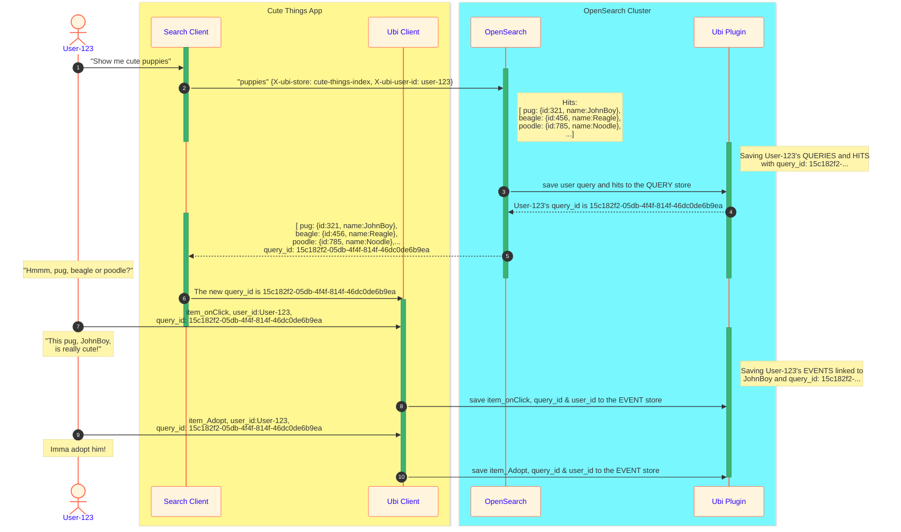

# Basic Ubi flow
**Executive Summary**: Once a user performs search, that search is tied to a `query_id`.  Then any following user events until the next search are logged and indexed by the search's `query_id`. If the user finds something of interest, that something's identifier (`object_id` or `key_value`) is logged in the event store with the `query_id`.

### Ubi Roles
- **Ubi Plugin**: in charge of initiating an Ubi store, saving all incoming queries associated with an Ubi store, and logging the Ubi events directly.
- **Search Client**: in charge of searching and recieving a `query_id` from the **Ubi Plugin**.  This `query_id` is then passed to the **Ubi Client**
- **Ubi Client**: in charge of logging user events, such as onClick, passing the data to the **Ubi Plugin**, with the appropriate `query_id`, if the event follows a search event that produced a `query_id`. 
If the user interacts with an *object* (book, product, etc.) that was returned from their search, that `object_id` is logged, tying the `query_id` to the `object_id`

# The *Cute Things Animal Rescue*
1) `User-123` searches for a cute puppy to adopt.
2) The *Cute Things App* relays the search to an OpenSearch Cluster where the `Ubi Plugin` is installed and listening for queries on the *cute-things-index*
A number of puppies up for adoption are found.
3) The *hits* and the query is saved in the **query** store, linked to the user, session and `query_id`
4) If no `query_id` is sent in from the client in a request header, a new `query_id` is generated and used to index the data, and then returned in the response.
5) OpenSearch's response headers will have the `query_id` indexed.
6) The application saves this id for the `Ubi Client` to log all user events to be associated with that search.
7)  `User-123` clicks on the pug to learn more about JohnBoy.
8) The `Ubi Plugin` saves this click event, `query_id`, `user_id` and the specific puppy's identifying information.
9) `User-123` initiates the adoption process for the pug, JohnBoy.
10) The `Ubi Plugin` saves this adoption event, `query_id`, `User-123` and the puppy's identifying information.