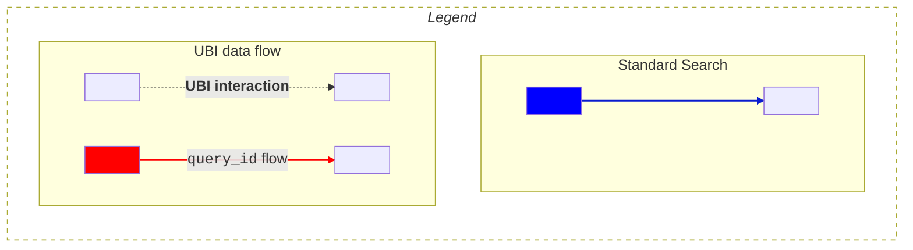

# Key User Behavior Insights concepts
**User Behavior Insights** (UBI) **data collection** is about linking user queries to specific actions (events) taken in response in an application.

## Key identifiers
UBI is not functional unless the links between the following fields are consistently maintained within a UBI-enabled application:

- [`query_id`](#query_id) is a unique id for the raw query language executed and the resultant `object_id`'s (_hits_) that the query returned.  
- [`client_id`](#client_id) represents a unique source of queries. Typically this will be a web browser used by a unique user. 
- [`object_id`](#object_id) represents an id for whatever object the user is recieving in response to a query. For example, if you search for books, it might be a ISBN code of a book such as `978-3-16-148410-0`.
- [`object_id_field`](#object_id_field) tells us the name of the field in your index that provides the `object_id`. For the book example, the value might be `isbn_code`.
- [`action_name`](#action_name), though not technically an ID, the `action_name` specifies the exact user action (such as `click`, `add_to_cart`, `watch`, `view`, or `purchase`) that was taken (or not taken) for an object with a given `object_id`.

To summarize, the `query_id` signals the beginning of a unique *search* for a client tracked through a `client_id`. The search returns various objects, each with a unique`object_id`. Every time a user performs an interaction, the `action_name` specifies what action the user is performing and is connected to the objects, each with a specific `object_id`. You can differentiate between types of objects by inspecting the `object_id_field`.  

Typically, you can infer the user's overall *search journey* by retrieving all the data for the user's `client_id` and inspecting individual `query_id` data. Each application decides what makes a *search session* by examining the data in the backend.

## Important UBI roles
- The **search client** is in charge of searching and then receiving *objects* from a document index in OpenSearch (1, 2, **5** and 7 in the following diagram).
 (1, 2, **5** and 7, in the following diagram)
- **User Behavior Insights** plugin: if activated in the `ext.ubi` stanza of the search request, manages the **UBI Queries** store in the background, indexing each query, ensuring a unique [`query_id`](#query_id) along with all returned resultant [`object_id`](#object_id)'s, and then passing the `query_id` back to the **Search Client** so that events can be linked to this query.
 (3, 4 and **5**, in following diagram)
- **objects**: are whatever items the user is searching for with the queries. Activating UBI involves mapping your real-world objects (using it's identifiers such as an `isbn` or  `sku`) to the [`object_id`](#object_id) fields in the index that is being searched.
- The **Search Client**, if separate from the **UBI Client**, forwards the indexed [`query_id`](#query_id) to the **UBI Client**.
 &ensp; *Note:* We break out the roles of *search* and *UBI event indexing* here, but many implementations will likely use the same OpenSearch client instance for both roles of searching and index writing. (6, following diagram)
- The **UBI Client** then indexes all user events with this [`query_id`](#query_id) until a new search is performed, and a new `query_id` is generated by **User Behavior Insights** plugin and passed back to the **UBI Client**
- If the **UBI Client** interacts with a result **object**, such as during a add to cart, then that [`object_id`](#object_id), `add_to_cart` [`action_name`](#action_name) and `query_id` are all indexed together, signalling the causal link between the *search* and the *object*.
 (8 and 9, following diagram)


The mermaid source below is converted into an png under 
.../images/ubi/ubi-schema-interactions.png

```mermaid
%%{init: {
  "flowchart": {"htmlLabels": false},

  } 
}%%
graph TB

User--1) <i>raw search string</i>-->Search;  
Search--2) <i>search string</i>-->Docs 
style OS stroke-width:2px, stroke:#0A1CCF, fill:#62affb, opacity:.5
subgraph OS[OpenSearch Cluster fa:fa-database]
  style E stroke-width:1px,stroke:red
  E[(&emsp;<b>UBI Events</b>&emsp;)]
  style Docs stroke-width:1px,stroke:#0A1CCF
  style Q stroke-width:1px,stroke:red
  Docs[(Document Index)] -."3) {<i>DSL</i>...} & [<i>object_id's</i>,...]".-> Q[(&emsp;<b>UBI Queries</b>&emsp;)]; 
  Q -.4) <span style="font-family:Courier New">query_id</span>.-> Docs ;  
end

Docs -- "5) <i>return</i> both <span style="font-family:Courier New">query_id</span> & [<i>objects</i>,...]" --->Search ;
Search-.6) <span style="font-family:Courier New">query_id</span>.->U;
Search --7) [<i>results</i>, ...]--> User

style *client-side* stroke-width:1px, stroke:#D35400
subgraph "`*client-side*`"
  style User stroke-width:4px, stroke:#EC636
  User["`**User**`" fa:fa-user]
  App
  Search  
  U
  style App fill:#D35400,opacity:.35, stroke:#0A1CCF, stroke-width:2px
  subgraph App[&emsp;&emsp;&emsp;&emsp;&emsp;&emsp;&emsp;UserApp fa:fa-store]
    style Search stroke-width:2px, stroke:#0A1CCF
    Search(&emsp;Search Client&emsp;)    
    style U stroke-width:1px,stroke:red
    U(&emsp;<b>UBI Client</b>&emsp;)
  end
end

User -.8) <i>selects</i> <span style="font-family:Courier New">object_id:123</span>.->U;
U-."9) <i>index</i> event:{<span style="font-family:Courier New">query_id, onClick, object_id:123</span>}".->E;

linkStyle 1,2,0,6 stroke-width:2px,fill:none,stroke:#0A1CCF
linkStyle 3,4,5,8 stroke-width:2px,fill:none,stroke:red
```



## UBI stores
There are 2 separate stores involved in supporting UBI data collection:

### 1) **UBI queries**
All underlying query information and results ([`object_id`](#object_id)'s) are stored in the `ubi_queries` index, and remains largely invisible in the background.

**UBI Queries** [schema](https://github.com/opensearch-project/user-behavior-insights/tree/main/src/main/resources/queries-mapping.json):
Since UBI manages the `ubi_queries` index, the developer should never have to write directly to this store (except for importing data).

- `timestamp` (events and queries) 
	&ensp; A UNIX timestamp of when the query was received

- `query_id` (events and queries) 
	&ensp; A unique ID of the query provided by the client or generated automatically. The same query text issued multiple times would generate different `query_id`. 
	
- `client_id` (events and queries)
  &ensp; A user/client ID provided by the client application

- `query_response_objects_ids` (queries)
	&ensp; This is an array of the `object_id`'s. This *could* be the same id as the `_id` but is meant to be the externally valid id of document/item/product.

### 2) **UBI events**
This is an index called `ubi_events` that the client side directly indexes events to, linking the event [`action_name`](#action_name), [`object_id`](#object_id)'s and [`query_id`](#query_id)'s together with any other important event information.
Since this schema is dynamic, the developer can add any new fields and structures (such as *user* information, *geo-location* information) at index time that are not in the current **UBI Events** [schema](https://github.com/opensearch-project/user-behavior-insights/tree/main/src/main/resources/events-mapping.json):

 
 

- `application` 
 &ensp; (size 100) - name of the application tracking UBI events (e.g. `amazon-shop`, `ABC-microservice`)
 
 
 

- `action_name` 
 &ensp; (size 100) - The name of the action that triggered the event. The UBI specification defines some common action names, but any name can be used.

 
 

- `query_id` 
  &ensp; (size 100) - The unique identifier of a query, typically a UUID, but can be any string.
  &ensp;Either the client provides this, or the `query_id` is generated at index time by the **UBI Plugin** and must be consistent in both the **UBI Queries** and **UBI Events** indexes.

 

- `client_id`
  &ensp; The client issuing the query. Typically this will be a web browser used by a unique user.
  &ensp;The `client_id` must be consistent in both the **UBI Queries** and **UBI Events** indexes.

- `timestamp`: 
  &ensp; When the event took place, typically in the `2018-11-13T20:20:39+00:00` format.

- `message_type` 
	&ensp; (size 100) - Group various `action_name`'s into logical bins such as `QUERY` or `CONVERSION`. 

- `message` 
	&ensp; (size 1024) - Optional text message for the log entry. For example, for a `message_type` of `QUERY`, we would expect the text to be about what the user is searching on.

- `event_attributes`'s 
  &ensp;Extensible structure that describes any important context about the event. Within it, it has 2 primary structures `position` and `object`, as well as being extensible to add anymore relevant, custom, information about the event can be stored such as timing information, individual user or session information.
  
  &ensp; Since this has a dynamic mapping, the index _could_ become bloated with many new fields
  {: .warning} 

 - **`event_attributes.position`** 
   &ensp; structure that contains information on the location of the event origin, such as screen *x, y* coordinates, or the *n-th* object out of 10 results:
 
   - `event_attributes.position.ordinal` 
     &ensp; tracks the *n-th* item within a list that a user could select, click (i.e. selecting the 3rd element could be event{`onClick, results[4]`})

    - `event_attributes.position.{x,y}` 
      &ensp; tracks x and y values, that the client defines

    - `event_attributes.position.page_depth` 
      &ensp; tracks page depth of results

    - `event_attributes.position.scroll_depth` 
      &ensp; tracks scroll depth of page results

    - `event_attributes.position.trail` 
      &ensp; text field for tracking the path/trail that a user took to get to this location
  
  - **`event_attributes.object`**, which contains identifying information of the object returned from the query that the user interacts with (i.e.: a book, a product, a post).
   The `object` structure has two ways to refer to the object, with `object_id` being the id that links prior queries to this object:
  
    - `event_attributes.object.internal_id` is a unique id that OpenSearch can use to internally to index the object, think the `_id` field in the indexes.

      

    - `event_attributes.object.object_id` 
      &ensp; is the id that a user could look up and find the object instance within the **document corpus**. Examples include: `ssn`, `isbn`, `ean`.  Variants need to be incorporated in the `object_id`, so for a t-shirt that is red, you would need SKU level as the `object_id`.
      Initializing UBI requires mapping from the **Document Index**'s primary key to this `object_id`
      

      

         
    - `event_attributes.object.object_id_field`
        &ensp; indicates the type/class of object _and_ the name of the field in the search index that has the `object_id`.  

    - `event_attributes.object.description` 
        &ensp; optional description of the object

    - `event_attributes.object.object_detail` 
        &ensp; optional text for further data object details
          
    - *extensible fields*: 
      &ensp;any new fields by any other names in the `object` that one indexes will dynamically expand this schema to that use-case.
      {: .warning}
