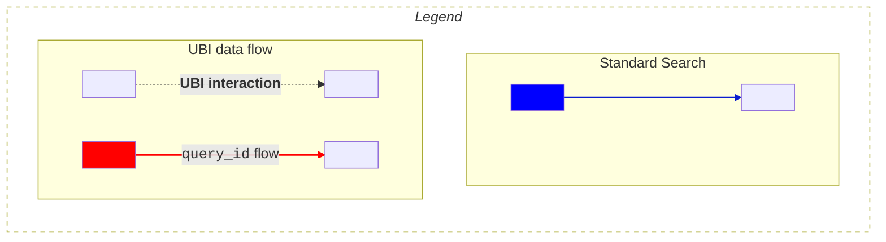
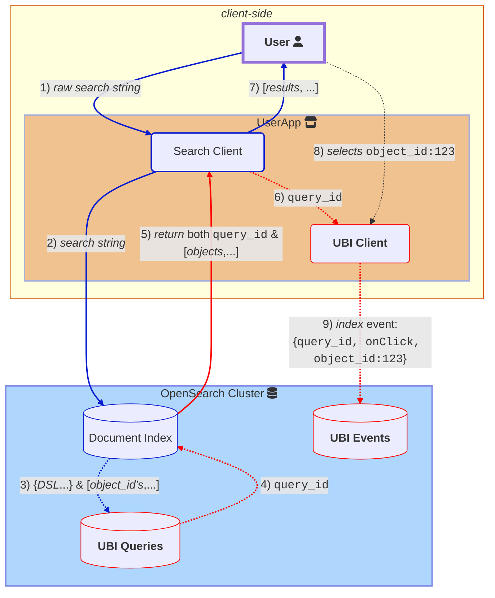

# UBI index schemas

The User Behavior Insights (UBI) data collection process involves tracking and recording the queries submitted by users, as well as monitoring and logging the subsequent actions or events they undertake after receiving the search results. There are two UBI index schemas involved in the data collection process:
* The [query index](#ubi-queries-index), which stores the searches and results.
* The [event index](#ubi-events-index), which stores all subsequent user actions after the user's query. 

## Key identifiers

For UBI to function properly, the connections between the following fields must be consistently maintained within an application that has UBI enabled:

- [`object_id`](#object_id) represents an ID for whatever object the user is receiving in response to a query. For example, if you search for books, it might be an ISBN code of a book such as `978-3-16-148410-0`.
- [`query_id`](#query_id) is a unique ID for the raw query language executed and the `object_id`'s (_hits_) that the user's query returned.  
- [`client_id`](#client_id) represents a unique source of queries. Typically, this is a web browser used by a unique user.
- [`object_id_field`](#object_id_field) specifies the name of the field in your index that provides the `object_id`. For the book example, the value might be `isbn_code`.
- [`action_name`](#action_name), though not technically an ID, specifies the exact user action (such as `click`, `add_to_cart`, `watch`, `view`, or `purchase`) that was taken (or not taken) for an object with a given `object_id`.

To summarize, the `query_id` signals the beginning of a unique search for a client tracked through a `client_id`. The search returns various objects, each with a unique `object_id`. Every time a user performs an interaction, the `action_name` specifies what action the user is performing and is connected to the objects, each with a specific `object_id`. You can differentiate between types of objects by inspecting the `object_id_field`.  

Typically, you can infer the user's overall search journey by retrieving all the data for the user's `client_id` and inspecting the individual `query_id` data. Each application decides what makes a search session by examining the data in the backend.

## Important UBI roles

The following diagram illustrates the process by which the **user** interacts with the **Search client** and **UBI client**, 
and how those, in turn, interact with the **OpenSearch cluster**, which houses the **UBI events** and **UBI queries** indexes.  

Blue arrows illustrate standard search. 
Bold, dashed lines illustrate UBI-specific additions.
Red arrows illustrate the flow of the [`query_id`](#query_id) to and from OpenSearch.


The mermaid source below is converted into an png under 
.../images/ubi/ubi-schema-interactions.png


Here are some key points regarding the roles:
- The **Search client** is in charge of searching and then receiving *objects* from a document index in OpenSearch.
   (1, 2, **5** and 7, in the preceding diagram)

Step **5** is in bold because it denotes UBI-specific additions like [`query_id`](#query_id) to standard OpenSearch interactions.
 {: .note}
- If activated in the `ext.ubi` stanza of the search request, the **User Behavior Insights** plugin manages the **UBI queries** store in the background, indexing each query, ensuring a unique [`query_id`](#query_id) along with all returned resultant [`object_id`](#object_id)'s, and then passing the `query_id` back to the **Search client** so that events can be linked to this query.
  (3, 4 and **5**, in preceding diagram)
- **Objects** represent the items that the user is searching for using the queries. Activating UBI involves mapping your real-world objects (using their identifiers such as an `isbn` or  `sku`) to the [`object_id`](#object_id) fields in the index that is searched.
- The **Search client**, if separate from the **UBI client**, forwards the indexed [`query_id`](#query_id) to the **UBI client**.
    Even though the the roles of *search* and *UBI event indexing* are separated on this diagram, many implementations can use the same OpenSearch client instance for both roles of searching and index writing. 
     (6 in the preceding diagram).
    {: .note} 
- The **UBI client** then indexes all user events with the specified [`query_id`](#query_id) until a new search is performed. At this time, a new `query_id` is generated by the **User Behavior Insights** plugin and passed back to the **UBI client**.
- If the **UBI client** interacts with a result **object**, such as during an **add to cart** event, then the [`object_id`](#object_id), `add_to_cart` [`action_name`](#action_name) and `query_id` are all indexed together, signaling the causal link between the *search* and the *object*.
  (8 and 9, preceding diagram)

## UBI stores

There are two separate stores involved in supporting UBI data collection:
* UBI queries
* UBI events

### UBI queries index

All underlying query information and results ([object IDs](#object_id)) are stored in the `ubi_queries` index, and remain largely invisible in the background.

The `ubi_queries` index [schema](https://github.com/OpenSearch-project/user-behavior-insights/tree/main/src/main/resources/queries-mapping.json) has the following fields:

- `timestamp` (events and queries): A UNIX timestamp of when the query was received.

- `query_id` (events and queries): A unique ID of the query provided by the client or generated automatically. Different queries with the same text generate different `query_id` values. 
	
- `client_id` (events and queries): A user/client ID provided by the client application.

- `query_response_objects_ids` (queries):  An array of [object IDs](#object_id). An ID can have the same value as the `_id` but it is meant to be the externally valid ID of a document, item, or product.

Since UBI manages the `ubi_queries` index, you should never have to write directly to this index (except when importing data).

### UBI events index

The client side directly indexes events to the `ubi_events` index, linking the event [`action_name`](#action_name), objects (each with an [`object_id`](#object_id)), and queries (each with a [`query_id`](#query_id)) along with any other important event information.
Because this schema is dynamic, you can add any new fields and structures (such as user information or geo-location information) that are not in the current **UBI events** [schema](https://github.com/opensearch-project/user-behavior-insights/tree/main/src/main/resources/events-mapping.json) at index time.

The following are the pre-defined, minimal fields within the `ubi_events` index:

Developers may define new fields under [`event_attributes`](#event_attributes).
{: .note}

 
 

- `application` (size 100) : The name of the application tracking UBI events (for example, `amazon-shop` or `ABC-microservice`).
 
 
 

- `action_name` (size 100) : The name of the action that triggered the event. The UBI specification defines some common action names, but you can use any name.

 
 

- `query_id` (size 100) : The unique identifier of a query, typically a UUID, but can be any string.
 :The `query_id` is either provided by the client or generated at index time by the UBI plugin. The `query_id` values in both the **UBI queries** and **UBI events** indexes must be consistent.

 

- `client_id`: The client issuing the query. Typically, the client is a web browser used by a unique user.
 :The `client_id` in both the **UBI queries** and **UBI events** indexes must be consistent.

- `timestamp`: When the event took place, either in UNIX format or formated as `2018-11-13T20:20:39+00:00`.

- `message_type` (size 100) : A logical bin for grouping actions (each with an `action_name`). For example, `QUERY` or `CONVERSION`. 

- `message` (size 1024) : An optional text message for the log entry. For example, for a `message_type` of `QUERY`, the `message` can contain the text related to a user's search.

 
 

- `event_attributes`: An extensible structure that describes important context about the event. This structure consists of two primary structures: `position` and `object`. The structure is extensible so you can add custom information about the event, such as the event's timing, user, or session.
  
 Because the `ubi_events` index is configured to perform dynamic mapping, the index can become bloated with many new fields.
  {: .warning} 

 - `event_attributes.position`: A structure that contains information about the location of the event origin, such as screen x, y coordinates or the object's position in the result list:
 
   - `event_attributes.position.ordinal`: Tracks the position within a list that a user could select (for example, selecting the 3rd element can be described as `event{onClick, results[4]}`).

    - `event_attributes.position.{x,y}`: Tracks x and y values defined by the client.

    - `event_attributes.position.page_depth`: Tracks the page depth of the results.

    - `event_attributes.position.scroll_depth`: Tracks the scroll depth of the page results.

    - `event_attributes.position.trail`: A text field for tracking the path/trail that a user took to get to this location.
  
  - `event_attributes.object`: Contains identifying information about the object returned from the query that the user interacts with (for example, a book, product, or post).
   The `object` structure can refer to the object by internal ID or object ID. The`object_id` is the id that links prior queries to this object. This field comprises the following subfields:
  
    - `event_attributes.object.internal_id`: A unique ID that OpenSearch can use to internally to index the object, for example, the `_id` field in the indexes.

      

    - `event_attributes.object.object_id`:  An ID by which a user can find the object instance within the **document corpus**. Examples include `ssn`, `isbn`, or `ean`.  Variants need to be incorporated in the `object_id`, so a red t-shirt's `object_id` should be its SKU.
      Initializing UBI requires mapping the document index's primary key to this `object_id`.
      

      

         
    - `event_attributes.object.object_id_field`: Indicates the type/class of the object and the name of the search index field that contains the `object_id`.  

    - `event_attributes.object.description`: An optional description of the object.

    - `event_attributes.object.object_detail`: Optional text for specifying further data about the object.
          
    - *extensible fields*: Any new indexed fields in the `object` dynamically expands this schema.
      {: .warning}
